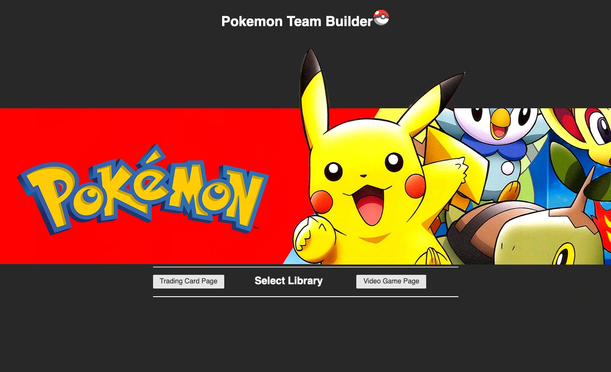
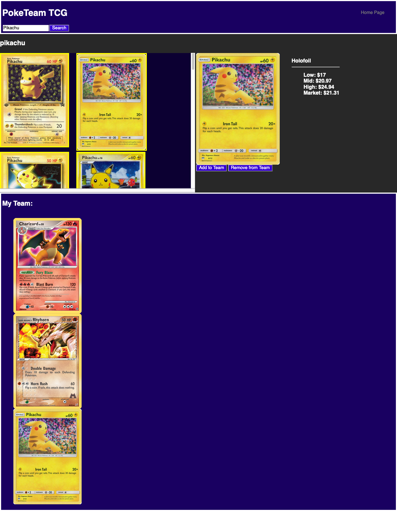
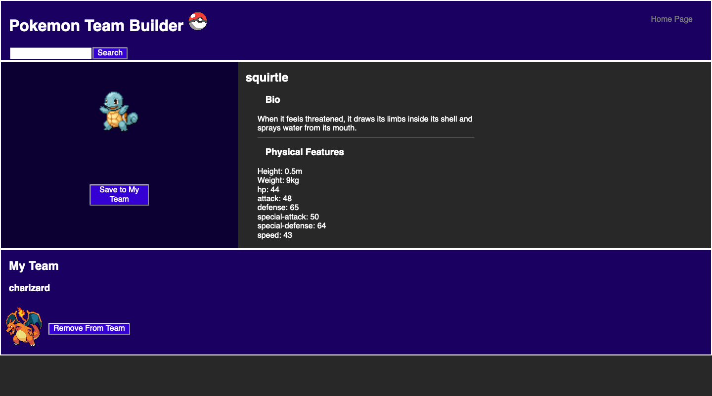

# pokemon-team-builder

## Our Task

This program was designed for the purpose of looking up the value of trading cards, and building a mock pokemon team from the video game. We give the user the ability to search through hundreds of pokemon and stats in order to build the perfect team. This experience is straight forward and was built using HTML/PureSS/CSS/ and JS. We were able to fetch the apis and populate the webpage to the users expectation, but improvements to the project could be adding filters to our search.

## Acceptance Criteria
According to the acceptance criteria this is what the user experiences

```
GIVEN I am using the website
WHEN I open the site
THEN I am given the option to go to either the TCG page or VG page
WHEN I am taken to either page
THEN If I already have a team it should pop up. If not nothing shoud happen
WHEN Search for a pokemon
THEN the pokeon must appear or I should see a list of all cards matching the name
WHEN I click into a specific card
THEN I a bigger photo shows up seperately and the information drops down. Along with an add and remove button.
WHEN I click the save button
THEN the card is saved to local storage and appears in the my team section
WHEN I click on the card
THEN the card is brought up to the profile section for the user to view
WHEN The remove buttons is pushed
THEN the card matching is removed from my team
WHEN I refresh the page
THEN cards saved in local storage show up in the my team section
```

## Screenshots




## Links
[GitHub Repo Link](https://github.com/amgaudet/pokemon-team-builder)
[Website Link](https://amgaudet.github.io/pokemon-team-builder)

## Authors
<p>Ryan Paynter and Alan Gaudet</p>

## Contact
Alan Gaudet - <alanmgaudet@gmail.com>
Portfolio - <https://github.com/amgaudet>
Ryan Paynter - <ryanpaynt@outlook.com>
Portfolio - <https://github.com/ryanpaynt>

## License
Copyright <2021> <COPYRIGHT Alan Gaudet and Ryan Paynter>